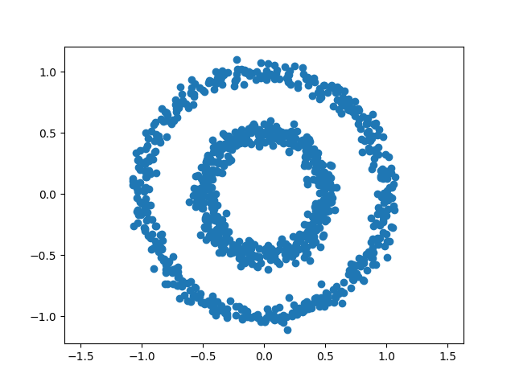
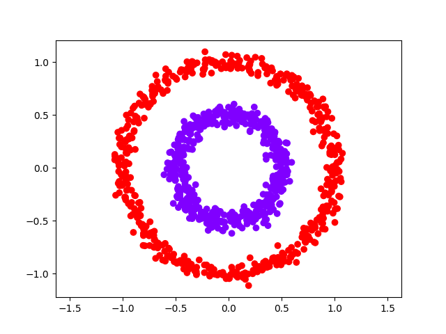
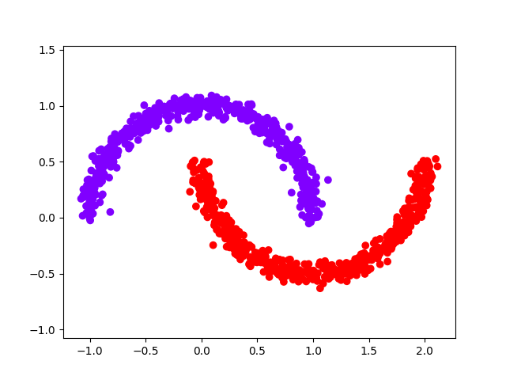

<!-- Parametric Spectral Clustering -->

# Parametric Spectral Clustering

This repository provides a PyTorch implementation of **Parametric Spectral Clustering (PSC)**, an advanced alternative to traditional spectral clustering. PSC addresses critical challenges in computational efficiency, memory consumption, and the lack of online learning capabilities. It serves as a scalable framework for applying spectral clustering to large datasets.

---

## PSC Class Parameters

The `PSC` class is the main interface for parametric spectral clustering. Here are the key parameters you can configure:

### Core Parameters

| Parameter | Type | Default | Description |
|-----------|------|---------|-------------|
| `n_clusters` | int | 10 | Number of clusters to find in the data |
| `n_components` | int | 0 | Number of embedding dimensions. If 0, defaults to `n_clusters` |
| `n_neighbor` | int | 8 | Number of neighbors for k-nearest neighbors graph construction |
| `model` | torch.nn.Module | Four_layer_FNN(64,128,256,64,10) | Neural network to learn the mapping from feature space to spectral space |
| `clustering_method` | sklearn.cluster | KMeans | Clustering algorithm to apply to the learned embeddings |

### Training Parameters

| Parameter | Type | Default | Description |
|-----------|------|---------|-------------|
| `epochs` | int | 50 | Number of training epochs for the neural network |
| `sampling_ratio` | float | 0.3 | Proportion of data used for training (0.0 to 1.0) |
| `batch_size_data` | int | 50 | Batch size for processing data chunks |
| `batch_size_dataloader` | int | 20 | Batch size for neural network training |
| `random_state` | int | None | Random seed for reproducibility |

### Advanced Parameters

| Parameter | Type | Default | Description |
|-----------|------|---------|-------------|
| `criterion` | torch.nn.modules.loss | nn.MSELoss() | Loss function for training the neural network |

### Parameter Guidelines

#### **n_neighbor (k-nearest neighbors)**
- **Small datasets** (< 1000 points): 5-10
- **Medium datasets** (1000-10000 points): 10-15  
- **Large datasets** (> 10000 points): 15-20
- **High-dimensional data**: May need larger values due to curse of dimensionality

#### **sampling_ratio**
- **0.0**: Use all data for training (no test split)
- **0.1-0.3**: Standard range for most applications
- **> 0.5**: Not recommended (insufficient training data)

#### **Model Architecture**
- **Input dimension**: Must match your data features
- **Output dimension**: Should match `n_components` (typically equals `n_clusters`)
- **Hidden layers**: Adjust based on data complexity

#### **Clustering Method**
- **KMeans**: Good for well-separated, spherical clusters
- **DBSCAN**: Good for clusters of varying density
- **AgglomerativeClustering**: Good for hierarchical relationships

### Example Configuration

```python
from ParametricSpectralClustering import PSC, Four_layer_FNN
from sklearn.cluster import KMeans

# For 2D data with 3 clusters
psc = PSC(
    n_clusters=3,                    # Find 3 clusters
    n_components=3,                  # 3D embedding space
    n_neighbor=10,                   # 10 nearest neighbors
    model=Net1(3),                   # Custom model with 3 outputs
    clustering_method=KMeans(n_clusters=3),
    sampling_ratio=0.1,              # Use 90% for training
    epochs=100,                      # More training epochs
    batch_size_data=100,             # Larger batches
    random_state=42                  # For reproducibility
)
```

 
## Dependencies

PSC requires the following dependencies:

- Python (>= 3.8)
- NumPy (>= 1.26.4)
- SciPy (>= 1.13.0)
- PyTorch (>= 2.2.2)
- scikit-learn (>= 1.4.2)
- Pandas (>= 2.2.2)
- Matplotlib (>= 3.8.4)

### User Installation

Use setup.py:

```sh
python setup.py install
```

Use pip:

```sh
pip install git+https://github.com/IvyChang04/PSC_library.git
```

## Sample Usage

### Example: Clustering Double Circles Dataset Using Python Code

The following figure shows the scatter plot of the double circles dataset.



This dataset is challenging for some clustering algorithms (e.g., K-means) because the one circle is inside another circle.  Our parametric spectral clustering learns to convert the data points into spectral space before clustering.

```python
import numpy as np
import matplotlib.pyplot as plt
import torch.nn as nn

from sklearn import cluster, datasets
from sklearn.preprocessing import StandardScaler
from ParametricSpectralClustering.psc import PSC

# learn the mapping from feature space to spectral space
class Net1(nn.Module):
    def __init__(self, out_put):
        super(Net1, self).__init__()
        self.fc = nn.Linear(2, 32)
        self.output_layer = nn.Linear(32, out_put)
        self.relu = nn.ReLU()
     def forward(self, x):
        x = self.fc(x)
        x = self.relu(x)
        x = self.output_layer(x)
        return x

n_samples = 1000
X, y = datasets.make_circles(n_samples=n_samples, factor=0.5, noise=0.05)

psc = PSC(
    model=Net1(2),
    clustering_method=cluster.KMeans(n_clusters=2, n_init=10, verbose=False),
    sampling_ratio=0,
    n_components=2,
    n_neighbor=10,
    batch_size_data=len(X)
)
psc.fit(X)
y_pred = psc.predict(X)
plt.scatter(X[:, 0], X[:, 1], c=y_pred, cmap="rainbow")
plt.axis("equal")
plt.show()
plt.close()
```

Here is the clustering result.




### Example: Clustering Double Moons Dataset Using Python Code

This double moons dataset is another challenging task for some clustering algorithms (e.g., K-means) because the shapes of the clusters are not convex.  The following shows the scatter plot and clustering results.



Here is the sample code.

```python
import numpy as np
import matplotlib.pyplot as plt
import torch.nn as nn

from sklearn import cluster, datasets, mixture
from sklearn.preprocessing import StandardScaler
from ParametricSpectralClustering.psc import PSC

class Net1(nn.Module):
    def __init__(self, out_put):
        super(Net1, self).__init__()
        self.fc = nn.Linear(2, 32)
        self.output_layer = nn.Linear(32, out_put)
        self.relu = nn.ReLU()
    def forward(self, x):
        x = self.fc(x)
        x = self.relu(x)
        x = self.output_layer(x)
        return x

n_samples = 1000
X, y = datasets.make_moons(n_samples=n_samples, noise=0.05)

psc = PSC(
    model=Net1(2),
    clustering_method=cluster.KMeans(n_clusters=2, n_init=10, verbose=False),
    sampling_ratio=0,
    n_components=2,
    n_neighbor=10,
    batch_size_data=len(X)
)
psc.fit(X)
y_pred = psc.predict(X)
plt.scatter(X[:, 0], X[:, 1], c=y_pred, cmap="rainbow")
plt.axis("equal")
plt.show()
plt.close()
```

### Example: Clustering Handwritten Digits Using Python Code

The following example demonstrates PSC applied to the **UCI ML handwritten digits dataset**.

```python
from ParametricSpectralClustering import PSC, Four_layer_FNN
from sklearn.datasets import load_digits
from sklearn.cluster import KMeans

# Load and normalize dataset
digits = load_digits()
X = digits.data / 16

# Define clustering method
cluster_method = KMeans(n_clusters=10, init="k-means++", n_init=1, max_iter=100, algorithm='elkan')

# Define PSC model
model = Four_layer_FNN(64, 128, 256, 64, 10)
psc = PSC(model=model, clustering_method=cluster_method, n_neighbor=10, sampling_ratio=0, batch_size_data=1797)

# Train the PSC model
psc.fit(X)

# Save and apply model
psc.save_model("model")
cluster_idx = psc.predict(X)
```

<!-- COMMEND LINE TOOL -->

### Example: Clustering Handwritten Digits Using Command Line Tool

After installation, you may run the following scripts directly.

```sh
python bin/run.py [data] [rate] [n_cluster] [model_path] [cluster_result_format]
```

**Arguments:**

* `[data]` - Path to the dataset (`.txt`, `.csv`, or `.npy` formats supported).
    
* `[rate]` - Proportion of data (between 0.0 and 1.0) reserved for training the mapping function from the original feature space to the spectral embedding.

* `[n_cluster]` - Number of clusters (must be less than the total dataset size).

* `[model_path]` - Path to save the trained model.

* `[cluster_result_format]` - Format of cluster results (`.txt` or `.csv`).

<!-- EXPERIMENT-->

# Experiment

The `JSS_Experiments` directory contains the experiments used in our study: "_PSC: A Python Package for Parametric Spectral Clustering_."

To run the experiments:

```sh
cd JSS_Experiments
python run_exp.py
```

The script:

1. Generates two synthetic datasets: "**Double Circles**" and "**Double Moons**".

1. Produces scatter plots for visualization.

1. Applies PSC to cluster these datasets.

1. Colors the scatter plot based on the assigned cluster IDs.

<!-- Test -->

# Test

To run unit tests, use:

```sh
pytest tests
```

<!-- LICENSE -->

# License

This project is licensed under the MIT License. See `LICENSE.txt` for details.

<!-- CONTACT -->

# Contact

For questions or collaborations, contact the authors:

* **Ivy Chang**: ivy900403@gmail.com

* **Hsin Ju Tai**: hsinjutai@gmail.com

* **Hung-Hsuan Chen**: hhchen1105@acm.org

